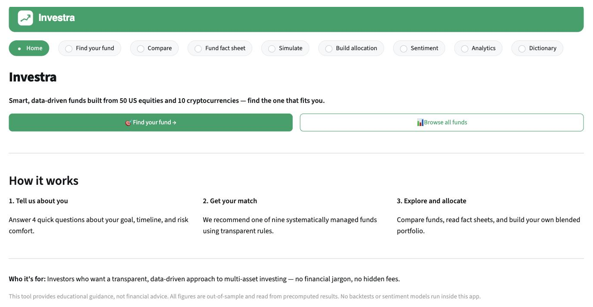
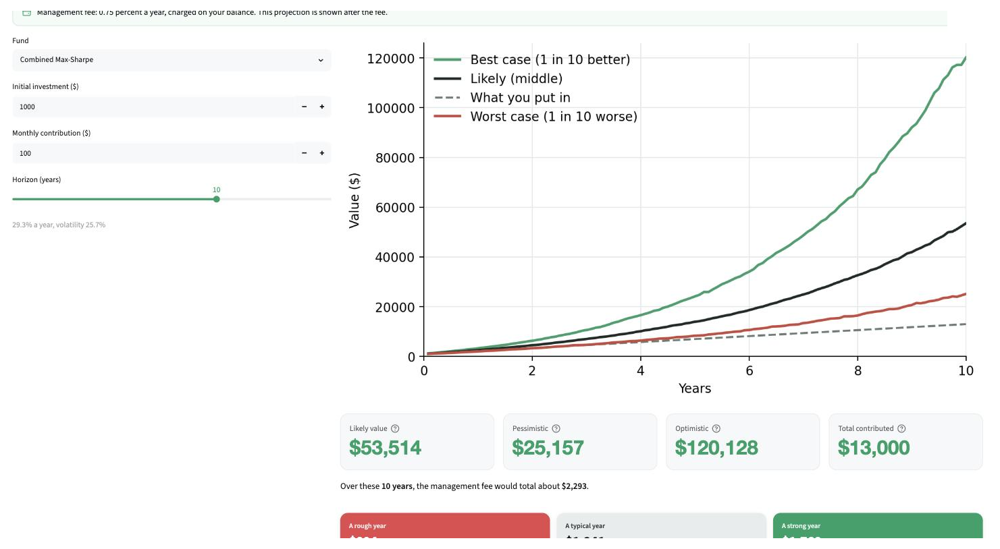
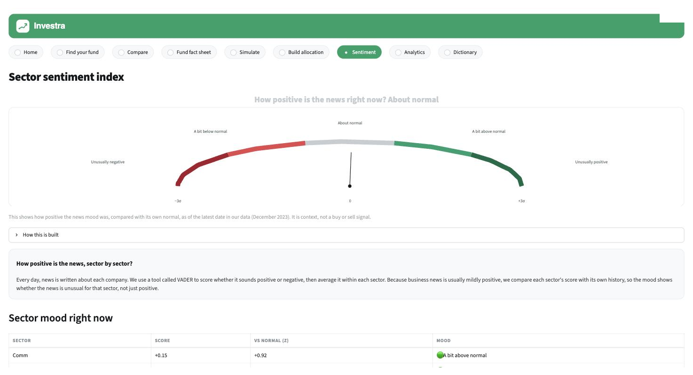

# Investra — a beginner-first systematic investing app

Investra turns clean market data into nine transparent, systematically built funds and guides a first-time investor from a short questionnaire to a matched fund, a plain-English fact sheet, an honest simulation, and a blended allocation. It reads the news as context rather than a trading signal and explains every term along the way.

**Live app:** https://z5642204projectb-e3ypahuwvrlcrwo3btndca.streamlit.app/

FINS5545 FinTech Project, Part B · z5642204 · Jeremia Mangapul Silitonga

## What it does
- **Find your fund** — four plain questions build a risk profile and match the investor to one of nine funds.
- **Compare** — the nine funds grouped into three comfort tiers and ranked for the investor.
- **Fund fact sheet** — growth against cash, the drawdown, the key metrics, and the current holdings.
- **Simulate** — a Monte Carlo projection showing the worst, likely, and best case in dollars.
- **Build allocation** — blend funds and see diversification lower the risk.
- **Sentiment** — a sector news-mood gauge standardised against each sector's own normal, shown as context, not a signal.
- **Analytics** — the efficient frontier, the correlation view, and the full metrics table for a more experienced investor.
- **Dictionary** — every term in plain English.

## Screenshots





## The funds
Nine funds from three universes (equity, crypto, combined) and three methods (maximum Sharpe, minimum variance, risk parity), built with a walk-forward out-of-sample backtest, monthly rebalancing, no look-ahead, 252 and 365 day annualisation, and a risk-free rate of zero.

## Run it locally
```
pip install -r requirements.txt
streamlit run streamlit_app.py
```
The app reads precomputed results from `results/`. To rebuild them, install `requirements-dev.txt` and run `python scripts/run_part_b.py`.

## Data
Raw prices and news load through `src/data_access.py` from the hosted dataset. Only derived artifacts are committed under `results/`.
